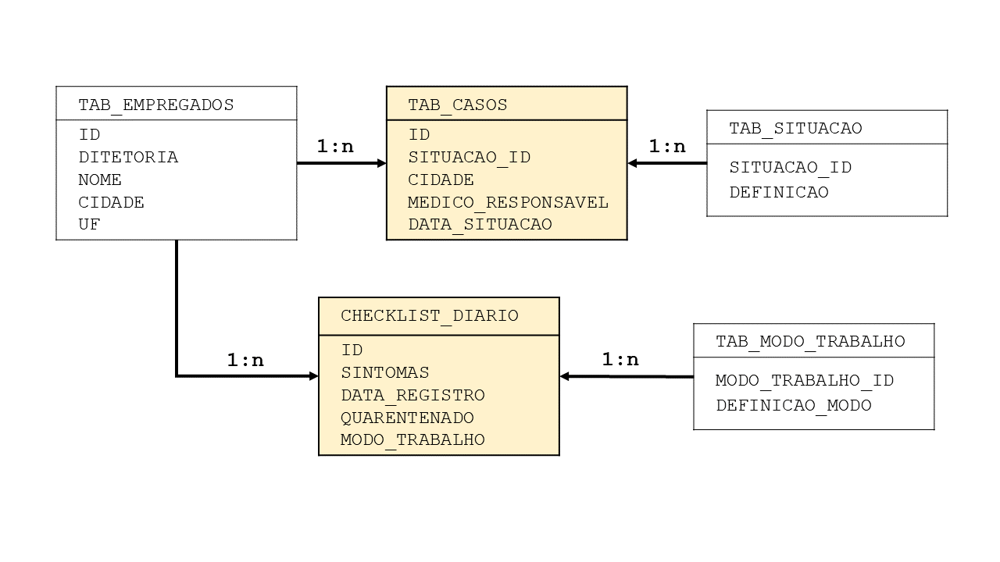

# Caso de Covid 19
## Analise da coleta de dados de uma empresa em contexto da pandemia

### A base de dados está anexo com o nome Covid_19. Pode baixar o arquivo e executar as querys em um gerenciador de SQLite.

> Com o decorrer da pandemia, nossa empresa foi obtendo os dados da situação dos funcionários em relação à doença e os sintomas. Esses dados foram salvos numa base, e agora, com objeto de tomar decisões estratégicas sobre o modo de trabalho, quantidade de funcionários por setor, etc., é que surgem da direção as seguintes perguntas:

1 - Quantos casos foram relatados no período por tipo de situação? (Ex: Confirmado, Confirmado Recuperado, etc)

2 - Qual o percentual de casos recuperados por Diretoria?

3 - Quais são os empregados que estão com status atual confirmado e tem uma situação anterior confirmado recuperado?

4 - Qual o percentual de casos por cidade dentro de cada UF? Ordene do maior para o menor.

5 - Qual o modo de trabalho mais recorrente com casos confirmados?

6 - Retorne os 3 maiores tipos de situação dentro de cada diretoria.


A base de dados gerada possui o seguinte esquema:

<p align="center">
  

  Com base nisso elaboramos as seguintes consultas em SQL para trazer respostas e visualizações para esses requisitos:
  
  **1)**
 ```
SELECT
	CASE
	WHEN SITUACAO_ID = '1' THEN "Confirmado" 
	WHEN SITUACAO_ID = '2' THEN "Confirmado recuperado"
	WHEN SITUACAO_ID = '3' THEN "Suspeito"
	WHEN SITUACAO_ID = '4' THEN "Descartado"
	WHEN SITUACAO_ID = '5' THEN "Óbito covid"
	WHEN SITUACAO_ID = '6' THEN "Óbito não covid"
	END AS Situacao,
	COUNT (SITUACAO_ID) AS "Quantidade"
FROM TAB_CASOS
GROUP BY 1
```
 **2)**
 ```
SELECT
	Recuperados.DIRETORIA,
	total_diretoria,
	Quant_recuperados,
	'  %  ' || ROUND((CAST (Quant_recuperados AS FLOAT)/Total_diretoria)*100,2) AS Percentual_diretoria
FROM 
(SELECT
	TAB_EMPREGADOS.DIRETORIA,
	TAB_SITUACAO.DEFINICAO,
	COUNT (TAB_CASOS.SITUACAO_ID) AS "Quant_recuperados"
FROM TAB_CASOS
INNER JOIN TAB_EMPREGADOS ON TAB_EMPREGADOS.ID = TAB_CASOS.ID
INNER JOIN TAB_SITUACAO ON TAB_SITUACAO.SITUACAO_ID = TAB_CASOS.SITUACAO_ID
GROUP BY 1,2
HAVING TAB_CASOS.SITUACAO_ID = "2") Recuperados
INNER JOIN 
(SELECT
	DIRETORIA, count (*) AS "Total_diretoria"
FROM TAB_CASOS
INNER JOIN TAB_EMPREGADOS ON TAB_CASOS.ID = TAB_EMPREGADOS.ID
GROUP BY DIRETORIA
ORDER BY 1) Totais
ON Totais.DIRETORIA = Recuperados.DIRETORIA

```
**3)**
 ```
SELECT
	TAB_CASOS.ID,
	CASE WHEN TAB_CASOS.SITUACAO_ID = '1' THEN 'Confirmado'
	ELSE ""
	END AS "Status_atual",
	TAB_CASOS.DATA_SITUACAO AS Data_atual,
	Sit_anterior.Status_anterior,
	Sit_anterior.Data_anterior
FROM TAB_CASOS

INNER JOIN
(
SELECT 
	ID,
	CASE WHEN SITUACAO_ID = '2' THEN 'Confirm_recuperado'
	ELSE ""
	END AS "Status_anterior",
	DATA_SITUACAO AS Data_anterior
FROM TAB_CASOS
GROUP BY 1,2
HAVING SITUACAO_ID = '2' 
) Sit_anterior
ON Sit_anterior.ID = TAB_CASOS.ID
WHERE TAB_CASOS.SITUACAO_ID = '1' AND Data_atual > Data_anterior
```

**4)**
```	
SELECT
	Casos_cidade.CIDADE,
	Casos_cidade.UF,
	Casos_cidade.Quant_cidade,
	Casos_UF.Quant_UF,
	'  %  ' || ROUND((CAST (Quant_CIDADE AS FLOAT)/Quant_UF)*100,2) AS Percent_cidade
FROM
(
SELECT
	TAB_CASOS.CIDADE,
	TAB_EMPREGADOS.UF,
	COUNT (SITUACAO_ID) AS Quant_cidade
FROM TAB_CASOS
LEFT JOIN TAB_EMPREGADOS ON TAB_EMPREGADOS.ID = TAB_CASOS.ID
GROUP BY 1,2
ORDER BY 2 ASC
) Casos_cidade
INNER JOIN
(SELECT
	TAB_CASOS.CIDADE,
	TAB_EMPREGADOS.UF,
	COUNT (UF) AS Quant_UF
FROM TAB_CASOS
LEFT JOIN TAB_EMPREGADOS ON TAB_EMPREGADOS.ID = TAB_CASOS.ID
GROUP BY 2 
) Casos_UF
ON Casos_UF.CIDADE = Casos_cidade.CIDADE
ORDER BY 3 DESC
```
	
**5)**
```
SELECT
	CHECKLIST_DIARIO.MODO_TRABALHO,
	TAB_CASOS.SITUACAO_ID,
	count( DISTINCT (TAB_CASOS.ID)) AS Quantidade
FROM TAB_CASOS
JOIN CHECKLIST_DIARIO ON CHECKLIST_DIARIO.ID = TAB_CASOS.ID
GROUP BY 1
```
	
**6)** 
```
SELECT
	TAB_EMPREGADOS.DIRETORIA,
	TAB_SITUACAO.DEFINICAO,
	COUNT (TAB_CASOS.SITUACAO_ID) AS Quantidade
FROM TAB_CASOS
INNER JOIN TAB_EMPREGADOS ON TAB_EMPREGADOS.ID = TAB_CASOS.ID
INNER JOIN TAB_SITUACAO ON TAB_SITUACAO.SITUACAO_ID = TAB_CASOS.SITUACAO_ID
GROUP BY 1,2
ORDER BY 1,3 DESC
```
	
